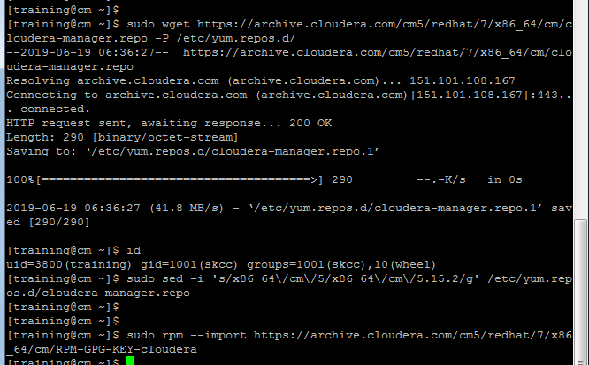

# Part I  

## 1. Create a CDH Cluster on AWS

### 1.0 Prepare   ( ALL Node)
1. yum update
```
$ sudo yum update
$ sudo yum install -y wget
```
2. firewall check and disable
```
[centos@cm ~]$ systemctl status firewalld
Unit firewalld.service could not be found.
```

* 해당 시스템은 firewalld 없음 필요시<br>
$ systemctl stop firewalld<br>
$ systemctl disable firewalld<br>

3. Selinux 정지
```
[centos@cm ~]$ sestatus
SELinux status:                 disabled
[centos@cm ~]$ sudo vi /etc/selinux/config
```


4. NTP 설정
```
[centos@cm ~]$ sudo yum install -y ntp
[centos@cm ~]$ sudo vi /etc/ntp.conf
[centos@cm ~]$ systemctl start ntpd
[centos@cm ~]$ systemctl enable ntpd
[centos@cm ~]$ ntpq -p
```


5. VM Swappiness 설정
```
at /proc/sys/vm/swappiness
sudo sysctl -w vm.swappiness=1
```
- VM Swappiness permanent
```
sudo vi /etc/sysctl.conf
  =>  vm.swappiness=1
```
6. SSH Connetion 설정
- Generate RSA private/public key for the user 'training'
- Append the public key to '~training/.ssh/authorized_keys'
- Append OpenSSH formatted private key to '~training/.ssh/id_rsa'


7. Disable Transparent Hugepage Support
```
sudo vi /etc/rc.d/rc.local
  =>  
echo "never" > /sys/kernel/mm/transparent_hugepage/enabled
echo "never" > /sys/kernel/mm/transparent_hugepage/defrag
sudo chmod +x /etc/rc.d/rc.local
sudo vi /etc/default/grub
   add -> transparent_hugepage=never (on line GRUB_CMDLINE_LINUX )
grub2-mkconfig -o /boot/grub2/grub.cfg
```

8. 필요시   IP V6 disable
```
sudo sysctl -w net.ipv6.conf.all.disable_ipv6=1
sudo sysctl -w net.ipv6.conf.default.disable_ipv6=1
```

### 1.a Linux Setup
1.a.i ADD Account   
- 3800 UID 로 training 계정 생성, 암호 설정, skcc 그룹 생성
- sudo 권한 부여
```
[centos@ip-172-31-39-152 ~]$ sudo groupadd skcc
[centos@ip-172-31-39-152 ~]$ sudo useradd training -u 3800 -g skcc
[centos@ip-172-31-39-152 ~]$ more /etc/passwd | grep skcc
skcc:x:3800:1001::/home/skcc:/bin/bash
[centos@ip-172-31-39-152 ~]$ sudo visudo
```


1.a.ii IP address and DNS
```
[centos@cm ~]$ getent hosts
```


1.a.iii List the Linux release
```
[centos@cm ~]$ cat /etc/os-release
NAME="CentOS Linux"
VERSION="7 (Core)"
ID="centos"
ID_LIKE="rhel fedora"
VERSION_ID="7"
PRETTY_NAME="CentOS Linux 7 (Core)"
ANSI_COLOR="0;31"
CPE_NAME="cpe:/o:centos:centos:7"
HOME_URL="https://www.centos.org/"
BUG_REPORT_URL="https://bugs.centos.org/"

CENTOS_MANTISBT_PROJECT="CentOS-7"
CENTOS_MANTISBT_PROJECT_VERSION="7"
REDHAT_SUPPORT_PRODUCT="centos"
REDHAT_SUPPORT_PRODUCT_VERSION="7"

[centos@cm ~]$ lsb_release -a
-bash: lsb_release: command not found
[centos@cm ~]$ hostnamectl
   Static hostname: cm
         Icon name: computer-vm
           Chassis: vm
        Machine ID: 05cb8c7b39fe0f70e3ce97e5beab809d
           Boot ID: 21ec7ad478054358a14b1fff83af9e6d
    Virtualization: kvm
  Operating System: CentOS Linux 7 (Core)
       CPE OS Name: cpe:/o:centos:centos:7
            Kernel: Linux 3.10.0-957.21.2.el7.x86_64
      Architecture: x86-64
```


1.a.iv List the filesystem capacity
```
[centos@cm ~]$ df -k
Filesystem     1K-blocks    Used Available Use% Mounted on
/dev/nvme0n1p1 104846316 1334116 103512200   2% /
devtmpfs         7872408       0   7872408   0% /dev
tmpfs            7895688       0   7895688   0% /dev/shm
tmpfs            7895688   16732   7878956   1% /run
tmpfs            7895688       0   7895688   0% /sys/fs/cgroup
tmpfs            1579140       0   1579140   0% /run/user/1000
[centos@cm ~]$ more /etc/fstab

#
# /etc/fstab
# Created by anaconda on Mon Jan 28 20:51:49 2019
#
# Accessible filesystems, by reference, are maintained under '/dev/disk'
# See man pages fstab(5), findfs(8), mount(8) and/or blkid(8) for more info
#
UUID=f41e390f-835b-4223-a9bb-9b45984ddf8d /                       xfs     defaul
ts        0 0
```

* 메모리 및  Process 상태를 확인하는 명령은 top 이 있음

1.a.v list command yum  repo list enabled
```
[centos@cm ~]$ sudo yum-config-manager --enable
```

1.a.vi /etc/passwd  training
```
[centos@cm ~]$ more /etc/passwd | grep training
training:x:3800:1001::/home/training:/bin/bash
```


1.a.viii /etc/group  skcc
```
[centos@cm ~]$ getent group skcc
skcc:x:1001:
[centos@cm ~]$ getent passwd training
training:x:3800:1001::/home/training:/bin/bash
```


### 1.b Install MySQL server
0) Answer in B part
b.1 command that shows hostname of DB SERVER
```
SHOW VARIABLES WHERE Variable_name = 'hostname';
```
b.2 server version
```
SHOW VARIABLES WHERE Variable_name = 'version';
```
b.3 data base list
```
SHOW DATABASES;
```

1)  Import Cloudera manager repository on mcm :  계정   trainning
```
sudo wget https://archive.cloudera.com/cm5/redhat/7/x86_64/cm/cloudera-manager.repo -P /etc/yum.repos.d/
sudo sed -i 's/x86_64\/cm\/5/x86_64\/cm\/5.15.2/g' /etc/yum.repos.d/cloudera-manager.repo
sudo rpm --import https://archive.cloudera.com/cm5/redhat/7/x86_64/cm/RPM-GPG-KEY-cloudera
```


2)  Install a supported Oracle JDK on your first node
```
sudo wget https://dev.mysql.com/get/Downloads/Connector-J/mysql-connector-java-5.1.46.tar.gz ~/
tar xvfz ~/mysql-connector-java-5.1.46.tar.gz
sudo mkdir -p /usr/share/java
sudo cp ~/mysql-connector-java-5.1.46/mysql-connector-java-5.1.46-bin.jar /usr/share/java/mysql-connector-java.jar
```


3)  Copy to all other nodes
```
scp /usr/share/java/mysql-connector-java.jar mn:~/
scp /usr/share/java/mysql-connector-java.jar w1:~/
scp /usr/share/java/mysql-connector-java.jar w2:~/
scp /usr/share/java/mysql-connector-java.jar w3:~/

ssh mn "sudo mkdir -p /usr/share/java; sudo mv ~/mysql-connector-java.jar /usr/share/java/"
ssh w1 "sudo mkdir -p /usr/share/java; sudo mv ~/mysql-connector-java.jar /usr/share/java/"
ssh w2 "sudo mkdir -p /usr/share/java; sudo mv ~/mysql-connector-java.jar /usr/share/java/"
ssh w3 "sudo mkdir -p /usr/share/java; sudo mv ~/mysql-connector-java.jar /usr/share/java/"

```

